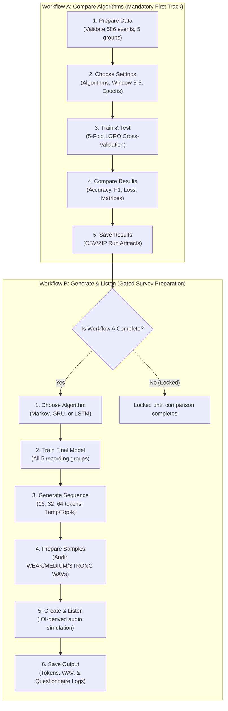

# Product Requirements Document (PRD)

## Project Title
**Comparative Analysis of Markov Chain, GRU, and LSTM Algorithms for Low-Resource Sadanga Gangsa-Based Rhythmic Event Sequence Generation**

- **Document Version**: 1.0.0
- **Document Status**: Final / Defense-Aligned
- **Target App**: `thesis_system` (Streamlit Research & Evaluation Platform)
- **Primary Research Focus**: Low-resource rhythmic event sequence modeling and human perceptual evaluation (musician resemblance study)
- **Target File Location**: Root Directory (`PRD.md`)

---

## 1. Executive Summary & Product Vision

### 1.1 Product Purpose
The **Sadanga Gangsa Research Platform** is a specialized, local computer science thesis platform designed to evaluate and compare generative sequence modeling algorithms under extreme low-resource conditions ($N = 586$ verified symbolic rhythmic events across 5 field recordings).

The platform serves two primary research goals:
1. **Objective Algorithmic Comparison (Workflow A)**: Benchmark Markov Chain (N-gram), Gated Recurrent Unit (GRU), and Long Short-Term Memory (LSTM) models using strict 5-Fold Leave-One-Recording-Out (LORO) cross-validation on next-event token prediction.
2. **Generative Simulation & Musician Evaluation (Workflow B)**: Generate symbolic rhythmic sequences, translate them into audio simulations using dataset-grounded empirical inter-onset interval (IOI) timing and authentic performance strike samples, and provide standardized audio stimuli for **human perceptual listening tests and questionnaire administration to musicians**.

### 1.2 Motivation for This PRD
Researchers require a formal Product Requirements Document to bridge the machine learning pipeline and the **subjective evaluation study**. Specifically, the research team is designing a structured questionnaire for musicians, percussionists, and cultural experts to determine:
- Do the algorithmic sequences bear a recognizable resemblance to traditional Sadanga Gangsa rhythmic patterns?
- Can trained musicians distinguish between baseline stochastic models (Markov Chain), recurrent neural networks (GRU, LSTM), and human ground truth?
- How do velocity dynamics (weak, medium, strong) and timing micro-structures contribute to perceived musical authenticity?

---

## 2. Research Scope, Defense Boundaries & Cultural Safety

To ensure defense safety and academic integrity, the platform strictly adheres to explicit research boundaries:

| Dimension | Defense-Approved Reality | Explicitly Forbidden Claim |
| :--- | :--- | :--- |
| **System Goal** | Low-resource rhythmic-event sequence modeling. | "Authentic Gangsa music generator" or "AI Composer". |
| **Tradition & Heritage** | Sadanga Gangsa-based rhythmic patterns. | "Recreates sacred rituals" or "replaces master indigenous musicians". |
| **Input Representation** | Discrete symbolic timing-gap + velocity categories. | Pitch/frequency modeling, raw waveform generation, or individual gong identities (*Kalsang*, *Salaksak*, etc.). |
| **Model Training** | Trains strictly on categorical token sequences. | "Trained on raw audio" or "generates audio end-to-end". |
| **Audio Stage** | Sample-rendered research simulation / auditory preview. | "Authentic master performance playback" (audio rendering is strictly an empirical simulation step). |

> [!IMPORTANT]
> **Defense Guardrail**: In thesis presentations, panel reviews, and questionnaires, the audio output must always be described as **"sample-rendered rhythmic sequence simulation"**, never as synthetic indigenous audio or traditional performance replacement.

---

## 3. User Personas & Target Audience

### Persona 1: Thesis Researchers (Primary Operators)
- **Needs**: Reproducible 5-fold LORO cross-validation, deterministic metric export (loss, accuracy, macro F1, top-k, perplexity), batch stimulus generation for empirical listening surveys.
- **Key Pain Point**: Preventing data leakage across recording boundaries in low-resource data.

### Persona 2: Evaluating Musicians & Domain Experts (Survey Participants)
- **Profile**: Practicing percussionists, ethnomusicologists, music educators, and Cordilleran cultural practitioners familiar with Gong/Gangsa traditions.
- **Needs**: Clean, standardized audio clips (16 to 32 events), clear evaluation criteria (meter, dynamic nuance, rhythmic cadence), and an intuitive questionnaire interface.
- **Key Pain Point**: Artificial playback artifacts or unnatural tempo jumps that distract from evaluating underlying rhythmic logic.

### Persona 3: Academic Panelists & Advisers
- **Needs**: Clear methodological transparency, auditable data drop logs, verifiable hyperparameter reporting, and zero metric falsification.

---

## 4. System Architecture & Workflows

The application is structured into two sequential workflows governed by strict state guards:



---

## 5. Functional Requirements Specification

### 5.1 Workflow A: Comparative Evaluation

#### FR-A1: Dataset Curation & Validation (`src/screens/compare/prepare_data.py`)
- **Dataset Source**: `verified_event_dataset.csv`.
- **Expected Data Standard**:
  - Exactly 5 recording groups (`PERF-001` to `PERF-005`).
  - Total of 586 verified rhythmic events (`PERF-001`: 235, `PERF-002`: 39, `PERF-003`: 34, `PERF-004`: 214, `PERF-005`: 64).
  - Mandatory columns: `group_id`, `event_index`, `event_token`.
  - Optional acoustic columns: `onset_seconds`, `ioi_seconds`, `onset_strength_norm`, `clip_filename`.
- **Validation Rules**:
  - Immutability: Read-only source file.
  - Drop Log: Unusable rows must be dropped in-memory with auditable diagnostic reasons.
  - Boundary Isolation: Sliding sequence windows must never span across two separate recording groups.

#### FR-A2: Experimental Setup (`src/screens/compare/settings.py`)
- **Algorithm Selection**: Multi-select support for Markov Chain / N-gram, GRU, and LSTM.
- **Window Size ($W$)**: Integer slider [3, 4, 5] (default $W=3$).
- **Hyperparameter Controls**:
  - Markov: Order (1 or 2), Additive Laplace smoothing ($\alpha \in [0.01, 1.0]$).
  - GRU & LSTM: Embedding dim (8, 16), Hidden dim (16, 32), Dropout (0.2–0.4), Learning rate (0.001–0.01), Batch size (8, 16), Max epochs (30–100), Early stopping patience.

#### FR-A3: 5-Fold LORO Cross-Validation Engine (`src/screens/compare/train_test.py`)
- **Zero Leakage**: Exactly 5 folds corresponding to the 5 recording groups. In fold $k$, held-out recording $\text{PERF-00}k$ is reserved for testing, while the remaining 4 recordings are used for training.
- **No Synthetic Fill**: Evaluation metrics must reflect true empirical performance. Poor performance in low-resource folds is legitimate research evidence.
- **Metrics Collected**:
  - Multi-class Accuracy (top-1)
  - Macro-Averaged F1-Score
  - Top-2 / Top-3 Accuracy
  - Categorical Cross-Entropy Loss & Perplexity
  - Training duration (seconds) and per-epoch convergence curves.

#### FR-A4: Results & Statistical Comparison (`src/screens/compare/results.py`)
- Visual aggregate tables showing Mean $\pm$ Standard Deviation across all 5 folds.
- Normalized confusion matrices for token transition error analysis.
- Statistical significance tests (paired t-test or Wilcoxon signed-rank across folds).

#### FR-A5: Artifact Export (`src/screens/compare/export.py`)
- Downloadable ZIP containing summary tables (`comparison_summary.csv`), fold-level breakdowns, confusion matrices, and manuscript-ready markdown tables.

---

### 5.2 Workflow B: Generation & Audio Simulation

#### FR-B1: Final Model Training (`src/screens/generate/final_training.py`)
- Gated state: Enabled only after Workflow A execution.
- Trained across **all 5 recording groups** (586 events) to maximize low-resource pattern exposure.
- Option for equal-weight sequence contribution to prevent large recordings (`PERF-001`, `PERF-004`) from drowning out minority recordings (`PERF-002`, `PERF-003`).

#### FR-B2: Symbolic Sequence Generation (`src/screens/generate/generate_sequence.py`)
- Sequence length: 16, 32, or 64 discrete rhythmic events (16–32 recommended for musician listening tests).
- Sampling controls: Temperature ($T \in [0.1, 2.0]$), Top-$k$ filtering ($k \in [1, 5]$), and Random Seed for deterministic reproducibility.
- Seed Prompts: Optional initial context (e.g., `START_MEDIUM`, `SHORT_STRONG`). Prompt tokens are visually distinguished from newly generated tokens.

#### FR-B3: Performance Sample Bank Audit (`src/screens/generate/sound_samples.py`)
- Upload and inspect actual isolated strike samples categorized into `WEAK`, `MEDIUM`, and `STRONG`.
- Timbre filtering: Option to lock sample playback to a single ensemble (e.g., `PERF-002`) to ensure acoustic consistency during evaluation.

#### FR-B4: Audio Rendering Engine (`src/screens/generate/listen.py`)
- **Strict Empirical IOI Derivation**: Inter-onset intervals (`SHORT`, `MEDIUM`, `LONG`) must be derived from the 25th percentile of actual `ioi_seconds` observed in the dataset (dataset-wide or ensemble-specific), never artificially invented.
- **Acoustic Shaping**:
  - Exponential decay envelope ($\approx 1200\text{ ms}$) to prevent destructive acoustic buildup.
  - Linear fade-in ($5\text{ ms}$) to eliminate click transients.
  - LONG interval compression cap ($0.75\text{ s}$) to prevent unnatural gaps.
  - Optional subtle interlocking ensemble texture to simulate multi-gong companion interplay.
- **Audio Output Standard**: SoundFile mono WAV, 22,050 Hz, normalized peak at $0.90$ FS.

#### FR-B5: Output & Survey Pack Export (`src/screens/generate/export.py`)
- Export generated symbolic tokens (`.csv`), rendered simulation audio (`.wav`), and timestamped event mapping logs (`.csv`).

---

## 6. Musician Questionnaire & Human Subjective Evaluation Protocol

This section provides the comprehensive design for administering the evaluation questionnaire to musicians.

### 6.1 Purpose of the Subjective Listening Test
While computational metrics (Loss, Accuracy, Macro F1) measure mathematical sequence prediction on held-out tokens, they cannot evaluate **musical plausibility, stylistic resemblance, or cultural resonance**. The musician evaluation protocol answers:

1. **Rhythmic Resemblance**: Does the computer-generated pattern sound like it belongs to the Sadanga Gangsa tradition rather than generic or random percussion?
2. **Algorithmic Discriminability**: Can expert listeners distinguish between sequences generated by Markov Chain, GRU, LSTM, and human ground truth?
3. **Metric & Dynamic Coherence**: Do the models maintain appropriate tempo consistency and dynamic contrast (weak vs. medium vs. strong strikes)?

### 6.2 Listening Test Methodology (Double-Blind MUSHRA-Inspired Protocol)

```
Test Format: Double-Blind Multi-Stimulus Comparison
Participant Task: Listen to standardized 16-to-32-event audio stimuli and rate them on Likert scales.
Stimulus Duration: 8 to 15 seconds per audio clip (22,050 Hz mono WAV).
```

#### Evaluation Conditions (Stimulus Sets)
For each test trial, participants listen to clips representing 5 distinct conditions presented in randomized order:
1. **Reference / Ground Truth (Human)**: Actual token sequence taken directly from a held-out verified recording (e.g., `PERF-001` or `PERF-004`), rendered through the identical audio simulation engine.
2. **Markov Chain Model (Order 1/2)**: Rhythmic sequence generated by the baseline N-gram model.
3. **GRU Model**: Rhythmic sequence generated by the trained Gated Recurrent Unit network.
4. **LSTM Model**: Rhythmic sequence generated by the trained Long Short-Term Memory network.
5. **Negative Control (Random / Shuffled Baseline)**: Randomly generated token sequence (or shuffled token distribution) serving as an anchor to verify listener attentiveness.

> [!TIP]
> **Controlled Variable**: All conditions use the exact same sound bank and audio rendering pipeline. This isolates the independent variable strictly to **rhythmic token sequence generation**, eliminating sound quality or timbre bias.

---

### 6.3 Target Participant Profiles & Inclusion Criteria

To ensure statistical and domain validity, questionnaire respondents should be categorized into two demographic cohorts:

- **Cohort A: Traditional Practitioners & Cordilleran Percussionists**
  - Experience performing Cordilleran gong music (*Gangsa*, *Pattong*, *Toppaya*, or related Northern Luzon gong traditions).
  - High sensitivity to cultural tempo, cadence, and interlocking dynamics.
- **Cohort B: General Musicians & Music Academics**
  - Formally trained percussionists, ethnomusicology students, or music educators without specific Cordilleran heritage.
  - High sensitivity to general metric stability, syncopation, and dynamic variation.

---

### 6.4 The Musician Questionnaire Instrument

The questionnaire consists of three sections: **Participant Demographics**, **Per-Stimulus Rubric Evaluation**, and **Comparative Resemblance Ranking**.

#### Section 1: Demographics & Musical Background
1. **Participant Identifier**: `[Anonymous ID / Code]`
2. **Years of Musical Experience**: `[ ] < 2 yrs | [ ] 2–5 yrs | [ ] 6–10 yrs | [ ] > 10 yrs`
3. **Primary Musical Role**: `[ ] Traditional Gong/Gangsa Practitioner | [ ] Percussionist | [ ] Music Educator/Academic | [ ] Composer/Producer`
4. **Familiarity with Sadanga / Cordilleran Gangsa Music**:
   - `[1] Not familiar at all`
   - `[2] Slightly familiar (heard recordings)`
   - `[3] Moderately familiar (studied/observed live)`
   - `[4] Very familiar (regular performer or cultural community member)`

---

#### Section 2: Per-Clip Subjective Evaluation Rubric (5-Point Likert Scales)
*Instructions to listener: "Listen to the following audio clip (approx. 10–12 seconds). Put on headphones. Rate each statement from 1 (Strongly Disagree) to 5 (Strongly Agree)."*

| Dimension | Survey Item / Question | 1 (Poor) | 2 (Fair) | 3 (Moderate) | 4 (Good) | 5 (Excellent) |
| :--- | :--- | :---: | :---: | :---: | :---: | :---: |
| **Q1. Rhythmic Resemblance** | *"The rhythmic pattern in this audio clip resembles the flow and timing of traditional Sadanga Gangsa ensemble playing."* | Strongly Disagree | Disagree | Neutral | Agree | Strongly Agree |
| **Q2. Metric & Timing Stability** | *"The tempo and timing gaps between strikes feel natural, rhythmic, and intentional (not erratic or random)."* | Strongly Disagree | Disagree | Neutral | Agree | Strongly Agree |
| **Q3. Dynamic Variation** | *"The alternation between loud (strong) and soft (weak) strikes sounds musically logical and expressive."* | Strongly Disagree | Disagree | Neutral | Agree | Strongly Agree |
| **Q4. Structural Repetition & Variation** | *"The clip exhibits a balance of recognizable cyclic repetition and natural variation typical of gong music."* | Strongly Disagree | Disagree | Neutral | Agree | Strongly Agree |
| **Q5. Overall Plausibility** | *"If told this pattern was played by a human ensemble, I would find it believable."* | Highly Unbelievable | Unlikely | Neutral | Plausible | Highly Believable |

---

#### Section 3: Direct Algorithm Comparison & Resemblance Ranking
*After listening to 4 anonymized clips generated with the same seed prompt:*

1. **Resemblance Ranking**: Rank the clips from **Most Similar** to **Least Similar** to genuine Sadanga Gangsa rhythm:
   - Rank 1 (Most Resembles Gangsa): `Clip [A / B / C / D]`
   - Rank 2: `Clip [A / B / C / D]`
   - Rank 3: `Clip [A / B / C / D]`
   - Rank 4 (Least Resembles Gangsa): `Clip [A / B / C / D]`
2. **Turing Identification Question**: *"Which of the clips above (if any) do you believe was played directly from human field recording transcriptions?"*
   - `[ ] Clip A | [ ] Clip B | [ ] Clip C | [ ] Clip D | [ ] None of them`
3. **Open Qualitative Feedback**:
   - *"What specific rhythmic features, timing pauses, or strike strengths made the most realistic clip sound genuine to you?"*
   - *"What unnatural habits (e.g. repetitive loops, odd pauses, unnatural velocity jumps) exposed the computer-generated clips?"*

---

### 6.5 Statistical Analysis Plan for Survey Results

To validate the thesis hypotheses, survey responses must undergo rigorous statistical analysis:

1. **Mean Opinion Score (MOS)**:
   Calculate mean and standard deviation for each algorithm across the 5 evaluation dimensions:
   $$\text{MOS}_{alg, dim} = \frac{1}{N} \sum_{i=1}^{N} \text{Score}_{i}$$
2. **Non-Parametric Significance Testing**:
   - Because Likert scores are ordinal, use the **Friedman Test** (or Kruskal-Wallis) to test whether perceptual scores differ significantly across the 4 models (Human, Markov, GRU, LSTM).
   - Perform post-hoc **Wilcoxon Signed-Rank tests** with Bonferroni correction for pairwise comparisons (e.g., Markov vs. LSTM, GRU vs. Human).
3. **Inter-Rater Reliability**:
   - Calculate **Fleiss' Kappa ($\kappa$)** or **Kendall's Coefficient of Concordance ($W$)** to confirm whether musicians agreed in their rankings or if perceptions varied widely.
4. **Correlation with Computational Metrics**:
   - Compute Spearman rank correlation between human resemblance scores and test perplexity/accuracy to determine if lower cross-entropy loss translates directly to higher perceived musicality.

---

## 7. Data Representation & Token Alphabet

The system operates strictly on discrete categorical tokens formed by combining timing class and onset strength:

$$\text{Token} = \langle\text{Timing Category}\rangle \_ \langle\text{Strength Category}\rangle$$

| Component | Categories | Definition in Pipeline |
| :--- | :--- | :--- |
| **Timing Category** | `START` | Initial strike of a performance sequence. |
| | `SHORT` | Inter-onset interval in lower empirical quartile ($\approx 0.15\text{s} - 0.28\text{s}$). |
| | `MEDIUM` | Intermediate inter-onset interval ($\approx 0.30\text{s} - 0.48\text{s}$). |
| | `LONG` | Extended inter-onset interval or cadential pause ($\approx 0.50\text{s} - 0.75\text{s}$). |
| **Strength Category** | `WEAK` | Low velocity strike (muted or ghost stroke). |
| | `MEDIUM` | Standard primary strike velocity. |
| | `STRONG` | Accented, high-velocity strike or downbeat stroke. |

### Complete Vocabulary ($\Sigma$):
`START_WEAK`, `START_MEDIUM`, `START_STRONG`, `SHORT_WEAK`, `SHORT_MEDIUM`, `SHORT_STRONG`, `MEDIUM_WEAK`, `MEDIUM_MEDIUM`, `MEDIUM_STRONG`, `LONG_WEAK`, `LONG_MEDIUM`, `LONG_STRONG`.

---

## 8. Non-Functional Requirements

### 8.1 Performance & Resource Constraints
- **Hardware Profile**: Local laptop / desktop CPU execution (Intel/AMD x86_64, minimum 8GB RAM).
- **Execution Times**:
  - Markov 5-Fold Evaluation: $< 2$ seconds.
  - GRU / LSTM 5-Fold Evaluation (30–50 epochs): $< 60$ seconds total on CPU.
  - Audio Rendering (32 events): $< 1.5$ seconds.
- **Dependency Isolation**: PyTorch must remain lazily imported. The app must run Markov Chain workflows seamlessly even if PyTorch is absent.

### 8.2 Reproducibility & State Invalidation
- **Deterministic Seeding**: Master random seed parameter controls both neural weight initialization and stochastic generation sampling.
- **Session State Dependency Cascade**:
  - Modifying the dataset invalidates: Folds, Evaluation Summaries, Final Models, Generated Sequences, and Rendered Audio.
  - Modifying model hyperparameters invalidates: Dependent evaluation results, Final Models, and Generated Sequences (preserves prepared dataset and sample bank).

### 8.3 Interface Accessibility & Tone
- High-contrast dark navy-black and teal color scheme (`#0B132B`, `#1C2541`, `#48CAE4`).
- Plain-English navigation for musicians and reviewers, with formal mathematical and algorithmic details confined to expandable drawers.

---

## 9. Traceability Matrix: From PRD to Musician Evaluation

To bridge this PRD directly with your field questionnaire, use the following operational mapping:

| Questionnaire Dimension | System Parameter / Feature in App | Expected Output File | Thesis Analysis Metric |
| :--- | :--- | :--- | :--- |
| **Timing Resemblance (Q1 & Q2)** | Dataset 25th-percentile IOI, LONG interval cap ($0.75\text{s}$) in `audio_service.py` | `mapping_log.csv`, `rendered_simulation.wav` | Mean Opinion Score (MOS) vs. Empirical IOI Distribution |
| **Dynamic Nuance (Q3)** | Strength tokens (`WEAK`, `MEDIUM`, `STRONG`) mapped to audited strike samples | `generated_tokens.csv` | Transition probability matrix of strike strengths |
| **Algorithmic Distinction** | Workflow B generation across Markov, GRU, and LSTM at $T=0.7, 1.0$ | Randomized Stimulus Pack (`WAVs`) | Friedman Test & Post-Hoc Wilcoxon Signed-Rank |
| **Ground-Truth Turing Test** | Ground-truth held-out tokens from `PERF-001` to `PERF-005` | Baseline Human Audio Stimulus | Confusion Rate (% of musicians mistaking model for human) |

---

## 10. Document Revision History

| Date | Version | Primary Changes | Author / Role |
| :--- | :---: | :--- | :--- |
| 2026-09-26 | 1.0.0 | Initial release of comprehensive PRD featuring full research boundaries, Workflow A & B specifications, audio simulation contracts, and complete Musician Evaluation Questionnaire protocol. | Lead Thesis Agent |
